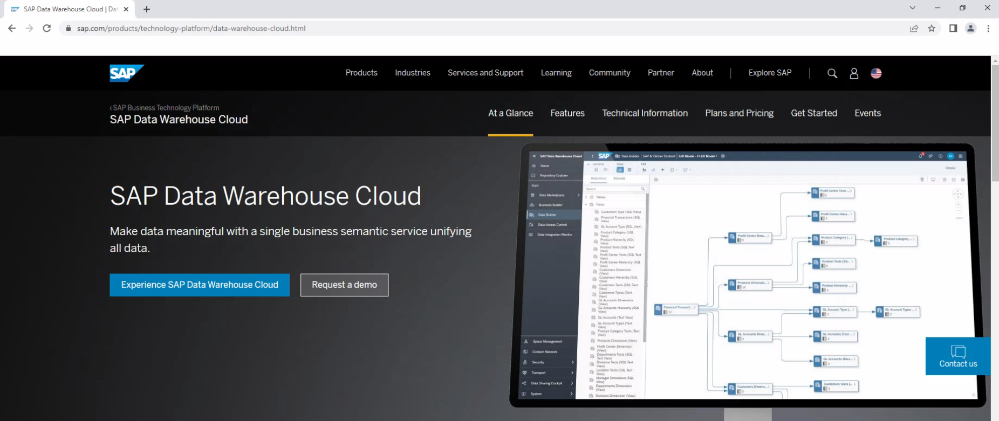
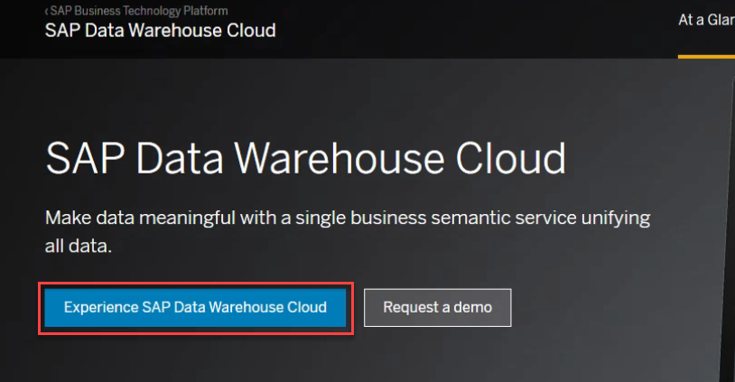
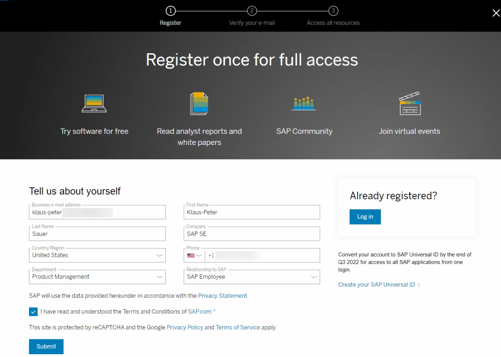
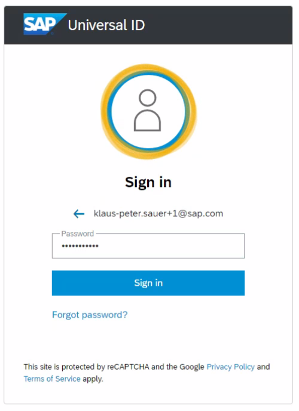
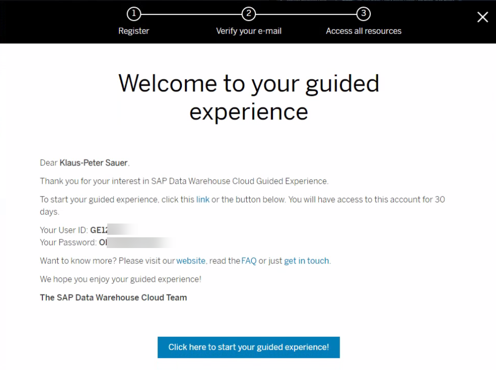
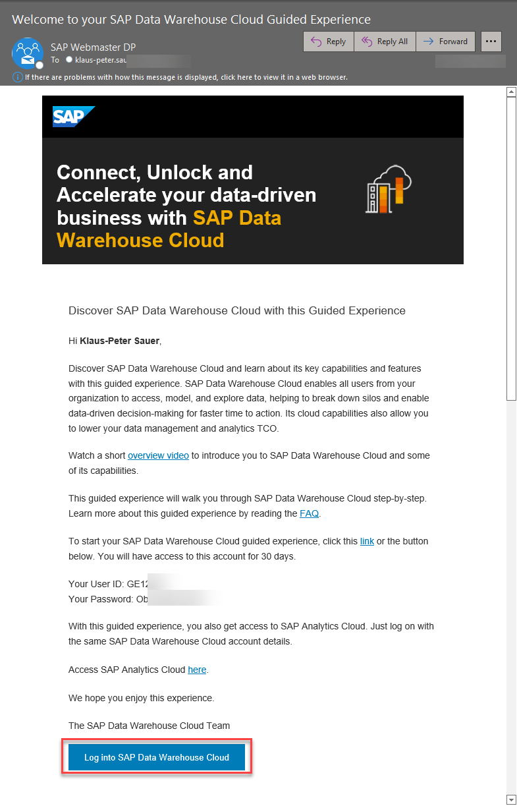
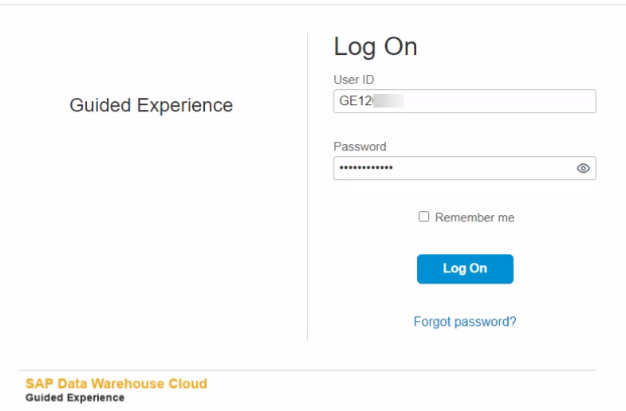
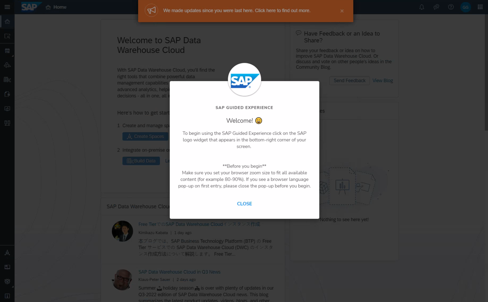

# Getting Started

## Get your guided experience trial system 

First you need to get your guided experience trial system of SAP Data Warehouse Cloud (mandatory).

1.	Navigate to the SAP Data Warehouse Cloud product page on sap.com:   https://www.sap.com/products/technology-platform/data-warehouse-cloud.html
 

2.  Click on the ***Experience SAP Data Warehouse Cloud*** button or alternatively use the follwing link  
https://www.sap.com/registration/trial.4d48ec23-eadf-4399-8595-ac3f9c66c64f.html
 

3.  The registration form will show up. Please enter the mandatory details and proceed using the ***SUBMIT*** button.  
:bulb: If you already have a SAP Universal ID then procees using the LOG IN button in the right of the form. 

 

4.  You then get an email to finalize you account. Activate your account by clicking on the button ***CLICK TO ACTIVATE YOUR ACCOUNT***

 
  
  Enter a password and click ***SUBMIT***.
   
  
5.  In case you already have a universal ID, you are asked to provide your existing password.
 

6.  Now your login details (user ID and password) are shown to you. 

 

  You will also get an email with the same information

 

7.  You can login into your guided experience trial tenant using the login details and the URL you have received.

 

8.  After a successful login you get to the welcome screen.

 

 

 

 

## Sample Business Scenario & Data Model Overview 

The sample data set for the session represents retail transactions from a number of outlet stores located in the United States. The transaction details include the store, the sold product, and the sales manager. In addition, the information on revenue, cost, discount, and profit is available for each transaction. 

The sales department is looking for a few analytics they need:

* **Year-over-Year Sales Comparison** 
They want to compare the current years’ company sales with the previous year.  

* **Sales Per Region** 
Due to an increase in the number of sales, the customer wants to understand how the different regions are  performing. Based on this visualization, the marketing team would identify the regions which are doing good as  well as the regions which need attention or better marketing campaigns  

* **Best Sales Representative** 
It is time for the company to reward the best Sales Representative for all the hard-work that has resulted in the  sales report. For this purpose, the company needs to have a visualization that shows revenue per sales  representative.  

The exercises will walk you through the steps using SAP Data Warehouse Cloud and SAP Analytics Cloud to answer those open questions, where the following tables are being used:  

| Table Name          | Description                           | Model Type          |
|:--------------------|:--------------------------------------|:--------------------|
| Sales Transactions  | Daily retail transactions per store   | Relational Dataset  |
| Store	              | Details per Store Outlet              | Dimension           | 
| Sales Manager       | Details on all Sales Manager          | Dimension           | 
| Product             | Details on the products being sold    | Dimension           | 

## Summary

Now that you have a guided experience trial system available and got a good understanding of the business scenario, we can start into the hands-on part.

Continue with [Exercise 01: First Log On (optional)](../ex01/README.md)
