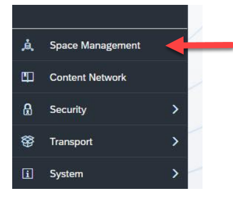
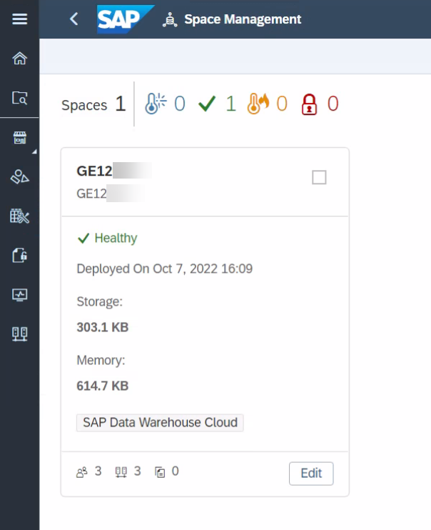
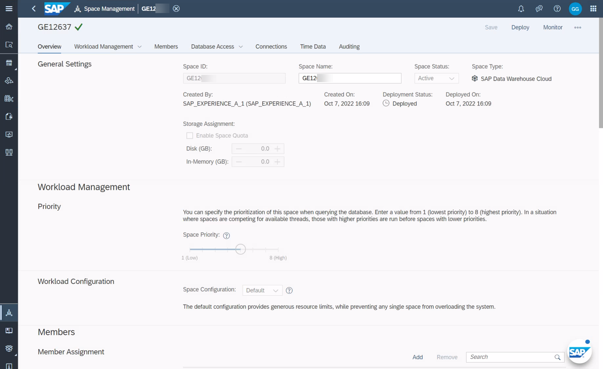
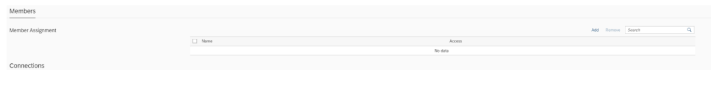

# Exercise 2 - Exercise 02: Get to know your own Space
In this exercise, we will create your own Space. Spaces as part of the SAP Data Warehouse Cloud solution are virtual team environments where your
administrator has the ability to assign users and roles, as well as additional resources, such as connections to data sources, and allocated space In SAP Data 
Warehouse Cloud all data related workflows start with theselection of a Space, so you can see the Space is a fundamental concept and therefore we need to setup our
Space as our first step.

1. In the menu on the left-hand side, select the option Space Management.
<br>

2. After you selected the menu item, you will be presented with a list of existing Spaces and you have the
ability to create a new Space.
<br>

3. Use the “+” symbol to start the process to create a new Space (top right corner)
<br>

4. Enter a Space Name – for our example use the following details:
- Space Name: ANA161_XX</li>
- Space ID: ANA161_XX</li>
<br>Please replace the “XX” with your assigned User Number<p>

5.  The Space ID will be suggested based on your Space Name, but you have the option to change it as well.
6. Click Create
<br>

7. You are now being presented with the properties of your new Space and you have the ability to configure the
following options:
- You can add Users to the Space.
- As part of the Storage Assignment you can decide, how much storage space overall you will allocate to
the Space and how much of the assigned storage space you will assign to the In-Memory allocation.
- You can assign the Space Priority, which will become relevant when multiple Spaces are sending
requests to the system and the assigned priority will then help to decide which request takes priority.

8. Ensure that you configure the Storage Assignment as shown here with 1 GB for Disk and 1 GB for inmemory.
<br>

9. Now use the “Add” option in the Members area to assign your user to the Space.
ANA161 - Explore SAP Data Warehouse Cloud from A to Z
<br>

10. Select the user matching your assigned user from the list of available users.
11. Click Add.
12. In the top right, click Save


## Exercise 2.2 Sub Exercise 2 Description

After completing these steps you will have...

1.	Enter this code.
```abap
DATA(lt_params) = request->get_form_fields(  ).
READ TABLE lt_params REFERENCE INTO DATA(lr_params) WITH KEY name = 'cmd'.
  IF sy-subrc = 0.
    response->set_status( i_code = 200
                     i_reason = 'Everything is fine').
    RETURN.
  ENDIF.

```

2.	Click here.
<br>

## Summary

You just created your first Space in SAP Data Warehouse Cloud and you can now start your next step and
create your first Table and Model.

Continue to - [Exercise 3 - Excercise 3 ](../ex3/README.md)
