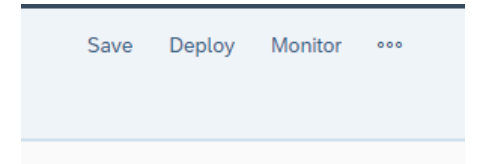
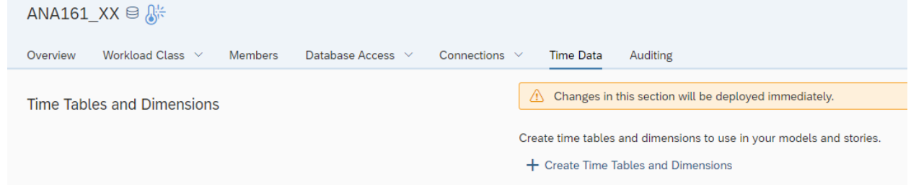

# Exercise 2 - Exercise 02: Get to know your own Space

:memo: **Note:** This is an OPTIONAL Exercise

In this optional exercise, we will show you your own Space. 
Spaces as part of the SAP Data Warehouse Cloud solution are virtual team environments where your administrator has the ability to assign users and roles, as well as additional resources, such as connections to data sources, and allocated storage.  In SAP Data Warehouse Cloud all data related workflows start with the selection of a Space, so you can see the Space is a fundamental concept.

:point_right: In case you do not use a guided experience trial system for this hands-on training, then you require a space on the SAP Data Warehouse Cloud tenant you are using. 

1. In the menu on the left-hand side, select the option Space Management.
 

2. After you selected the menu item, you will be presented with a list of existing Spaces .
 

4. Click the ***EDIT*** button on your assigned space. 
The pre-defined spaces are usually named the same way as your user ID for example GE12345. The technical is usually identical to the space name. 

5.  The Space ID will be suggested based on your Space Name, but you have the option to change it as well.
6. Click Create
 

7. You are now being presented with the properties of your new Space and you have the ability to configure the
following options:
- You can add Users to the Space.
- As part of the Storage Assignment you can decide, how much storage space overall you will allocate to
the Space and how much of the assigned storage space you will assign to the In-Memory allocation.
- You can assign the Space Priority, which will become relevant when multiple Spaces are sending
requests to the system and the assigned priority will then help to decide which request takes priority.

8. Ensure that you configure the Storage Assignment as shown here with 1 GB for Disk and 1 GB for inmemory.
 

9. Now use the “Add” option in the Members area to assign your user to the Space.
ANA161-Explore SAP Data Warehouse Cloud from A to Z
 

10. Select the user matching your assigned user from the list of available users.
11. Click Add.
12. In the top right, click Save
 

13. Click on “+ Create time Tables and Dimensions”.
 

14. For the From Year enter 2019.
15. For the To Year enter 2022.
16. For all other elements leave the default values.
17. Click Create.
This will create a set of Date / Time Tables which we will use as part of our model to create a date hierarchy
(Year, Quarter, Month, Day).
18. In the top right, click Save
 

19. In the top right, click Deploy.

## Summary

You just created your first Space in SAP Data Warehouse Cloud and you can now start your next step and
create your first Table and Model.

Continue to - [Exercise 03: Prepare Your Data (optional) ](../ex03/README.md)
