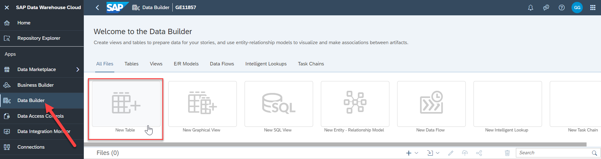
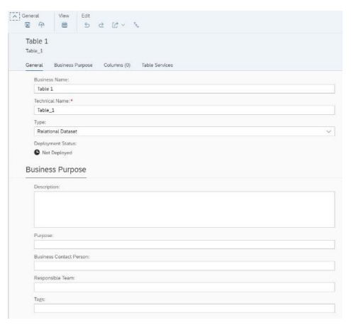

# Exercise 3 - Data Layer - Prepare Your Data

Before we are going to start with our first exercise in creating a table and creating our first model, lets clarify the
different asset types that you can create in SAP Data Warehouse Cloud.
When you launch the Data Builder from the menu, you will be presented with this screen:
 

So, let’s now look at the different asset types:
- Table: Here you basically define a new table from scratch, and you configure each field of the table and
you do have the ability then to upload data to this table later on.

- Graphical View: In the Graphical View you can leverage Tables and Views to the create new Views
using a visual interface.

- SQL View: In the SQL View you can leverage Tables and Views to the create new Views by using SQL
directly.

- Entity Relationship Model: Here you define the relationships between Tables or Views, which then are
being leveraged when you create a new View based on the Tables or Views.

- Data Flow: Here you can define data transformations and leverage the option to load data from a source
system into SAP Data Warehouse Cloud.

In this section we will start creating the tables for our sample models and then upload the raw data to those
tables. In the first part of this overall section, we will look at the sample model and which tables we will need. In
the second part we will then create those tables in SAP Data Warehouse Cloud and finally in the third part, we
will upload the raw data to those newly created tables, and we will also setup a hierarchy as part of the tables.

In the next steps we will setup a relatively simple data model and we will start by creating the tables first and
then upload the information for each table in form of CSV Files

In the next steps we will start to create the tables in SAP Data Warehouse Cloud.

1. Log On to your SAP Data Warehouse Cloud tenant.

2. Select the menu option Data Builder on the left-hand side.

3. In case you are being asked, select your previously created Space – ANA161_XX.

 
4. Select the option New Table

 
5. You are being presented with the details to create a new table.
6. Enter the following details: <ul><li>Business Name - Sales Transactions</li><li>Technical Name - Sales Transactions</li><li>Type - Relational Dataset
 

7. We also can provide already as part of the table, some business description and Tags, which then will be
used as part of the Business Catalogue.

8. Enter the following details for the Business Purpose: <ul><li>Description - This is the table for the Sales Transactions</li><li>Tags - Sales transaction, Revenue, transactions 

Tags:

:bulb: **Tip:** Please note, that when entering the Tags, you have to enter each tag individually for now and you can’t enter
multiple tags separated by comma right now.

9. Scroll down to the area Columns (you can also use the tabs in the page header for navigation). Here you
define now the structure of the table by adding the individual columns.
 

10. Use the “+” sign in the top right corner of the Columns area to start the process of creating your first table
column
 

11. You now need to enter a Business Name, a Technical Name, and you need to configure the Data Type
12. For the first column, enter the following details: <ul><li>Business - Name Transaction ID</li><li>Technical Name - Transaction_ID</li><li>Data Type - Integer64 

Data Type:

:bulb: **Tip:** Please note, that you can change the Data Type simply by clicking on the item in the Data Type column.

13. After you entered the details for the first column, please enter the following additional columns:

## Summary

You've now ...

Continue to - [Exercise 3 - Excercise 3 ](../ex3/README.md)
