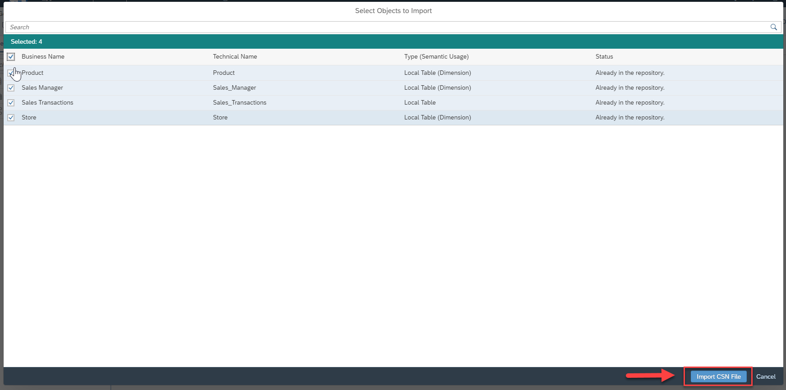

# Exercise 5 - Importing Tables

:memo: **Note:** This is a <strong>MANDATORY</strong>  Exercise

:bulb: **Tip:** This exercise is only required in case you did not create the tables and the Entity Relationship Model for our sample model manually, but instead prefer to import them.

The file for this exercise is “Sales Model - Entity Relationship Model.json” and the file is part of the ZIP file you downloaded.

We will now import the table definitions in form of JSON file by importing a Entity Relationship Model.
1. Log On to your SAP Data Warehouse Cloud tenant.
2. Select the menu option Data Builder on the left-hand side.
3. Select the option New Entity – Relationship Model.
4. In the New Entity Relationship Model, navigate to the toolbar.
5. Navigate to the Edit menu.
  UPLOAD

6. Open the Import option.
7. Select the option Import from CSN File.
8. Select the file “Sales Model - Entity Relationship Model.json”
9. Click Next.
  UPLOAD

10. Select all tables.
11. Click Import CSN File.
12. You will receive a message about the import being completed and the tables will be shown on the canvas in form of the imported Entity Relationship Model.
  UPLOAD

13. Save the changes to your Entity Relationship model using the Save option in the General menu.
  UPLOAD

14. Enter the following details: <ul><li>Business Name - Sales Model - Entity Relationship Mode</li><li>Technical Name - Sales_ER_Model
   
  
15. Click Save.
16. Deploy the model using the Deploy option in the General menu.

## Summary

As part of the deployment of the Entity Relationship Model, also the underlying tables are being imported and deployed. When you navigate to the Data Builder screen, you should now see a set of 4 tables / dimensions and 1 Entity Relationship Model.

Continue to - [Uploading Data (mandatory) ](../ex06/README.md)
