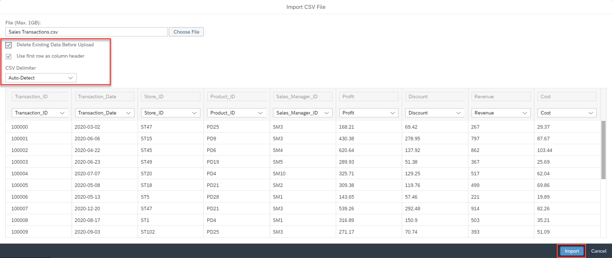

# Exercise 6 - Uploading Data

:memo: **Note:** This is a <strong>MANDATORY</strong>  Exercise

In this exercise, we will create...NEED TO FILL IN 

The files for this exercise are part of the ZIP file you downloaded in the beginning.
We will now upload the CSV files into the corresponding tables.
1. Log On to your SAP Data Warehouse Cloud tenant.
2. Select the menu option Data Builder on the left-hand side.
3. Use a double-click on the table Sales Transactions.
4. Select the menu option Upload Data from CSV File in the toolbar.
  

5. Click Choose File.  
6. Navigate to where you unzipped the download.
7. Select the file “Sales Transactions.csv”.
  

8. Ensure the option Use first row as column header is enabled.
9. Ensure the CSV Delimiter option is set to Auto-Detect.
10. Ensure the option Delete Existing Data Before Upload is enabled.
11. Ensure that all columns of the table have a mapped column from the CSV File.
12. Click Import.

  

13. You should receive a message about the successful import of the information.
14. There is no need to save / deploy the table after you imported the data.

You can now continue and repeat the steps for the other tables. Each table does have a corresponding CSV file
as part of the download.
Please upload the data for the following tables:
- Product
- Store
- Sales Manager

## Summary

You've now imported all your files. 

Continue to - [Creating the Dimension (mandatory)](../ex07/README.md)
