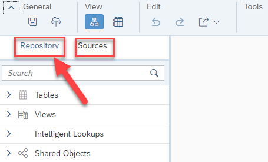
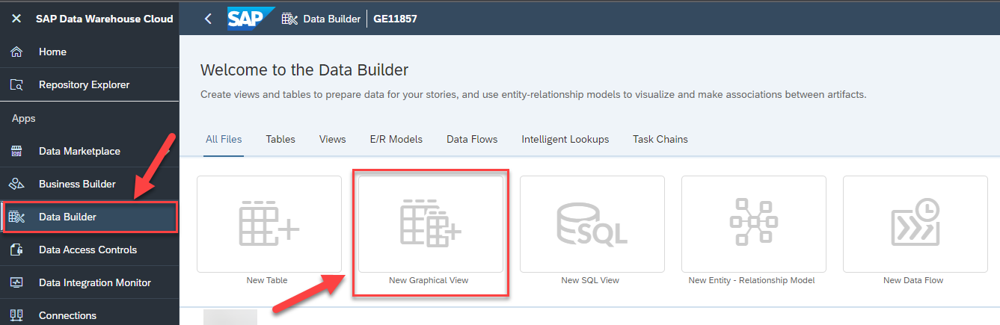

# Exercise 7 - Creating the Dimension 

In this exercise, we will create our first dimension. Part of the steps of defining the dimension will also be to configure the
geographic enrichment, so that we can leverage the Store Location later in SAP Analytics Cloud.

In the next steps we will create the new Dimension View based on our previously created tables
1. Log On to your SAP Data Warehouse Cloud tenant.
2. Select the menu option Data Builder on the left-hand side.
<br> UPLOAD

3. Click New Graphical View.
<br> UPLOAD

4. On the left-hand side you can decide between:<br><ul><li>Repository: Here you have access to the local tables (imported data) and Views.</li><li>Sources: Here you have access to your connections and the remote tables.
<br>

5. Ensure you select the option Repository.
6. Open the list of Tables.
<br> UPLOAD

7. You are presented with the list of tables, which we created previously.
8. Drag and Drop the table Store to the canvas.
<br> UPLOAD

9. You automatically will – in addition to the table you dragged to the canvas – receive the output view as well, in our example called View 1
10. Now click on the table Store on the canvas.
<br> UPLOAD

11. When you select the table on the canvas, you have the following options (top to bottom)<br><ul><li>(1) You can add Filter on top of the Table.</li><li>(2) You can Rename or Hide columns as part of a Projection.</li><li>(3) You can add Calculated Columns.</li><li>(4) You can add an Aggregation View.</li><li>(5) You can add additional tables / views based on suggested joins, which are based on your Entity
Relationship model.</li><li>(6) You can open the table in the editor.</li><li>(7) You can preview the data.
<br>


## Exercise 2.1 Sub Exercise 1 Description

After completing these steps you will have created...

1. Click here.
<br>

2.	Insert this line of code.
```abap
response->set_text( |Hello ABAP World! | ). 
```


## Exercise 2.2 Sub Exercise 2 Description

After completing these steps you will have...

1.	Enter this code.
```abap
DATA(lt_params) = request->get_form_fields(  ).
READ TABLE lt_params REFERENCE INTO DATA(lr_params) WITH KEY name = 'cmd'.
  IF sy-subrc = 0.
    response->set_status( i_code = 200
                     i_reason = 'Everything is fine').
    RETURN.
  ENDIF.

```

2.	Click here.
<br>

## Summary

You've now ...

Continue to - [Exercise 3 - Excercise 3 ](../ex3/README.md)
