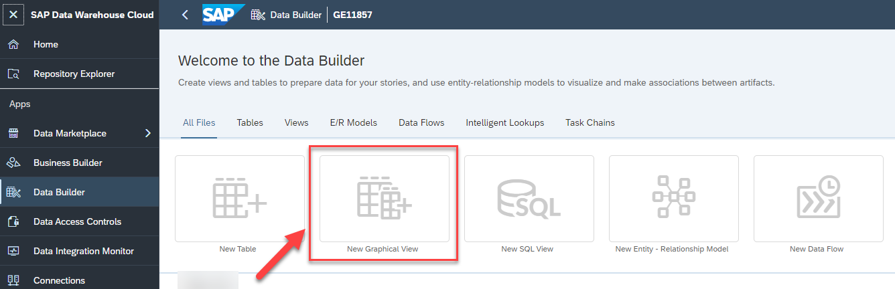
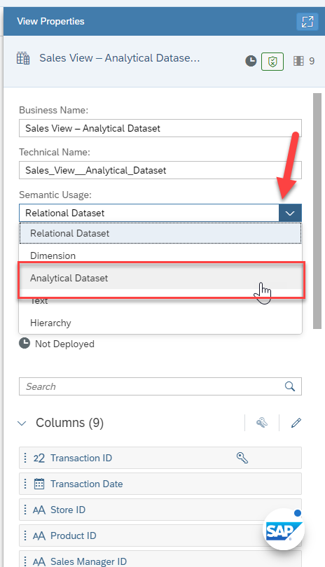
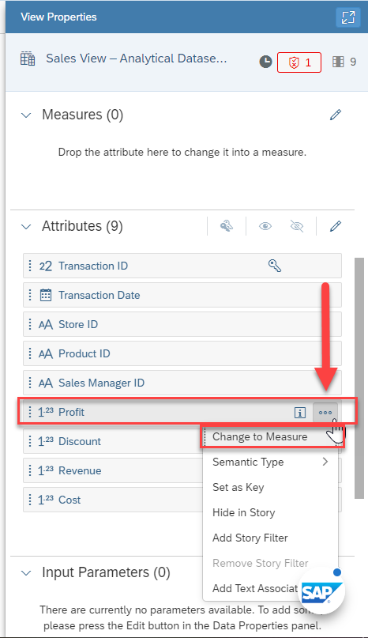
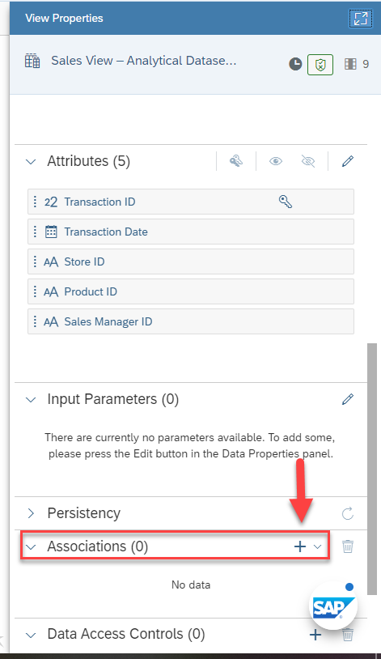
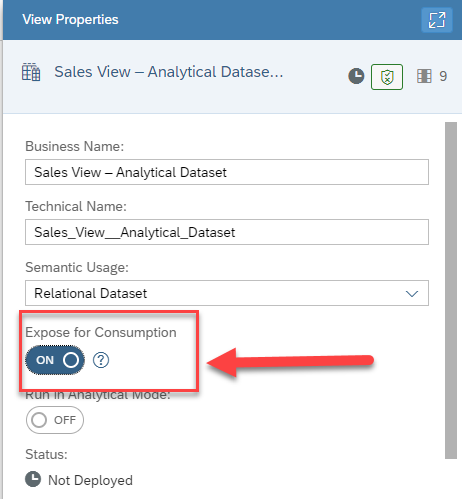

# Exercise 8 - Creating the View 

In this exercise, we will create our first view, combining the tables into an asset in SAP Data Warehouse Cloud, which then can be consumed in SAP Analytics Cloud.

A view in SAP Data Warehouse Cloud provides you with several benefits:
- Graphical or script-based editor
- Define views on top of remote, replicated data sources, or tables
- Define unions and joins, rename and remove columns, add calculations and filters
- Create Analytical Datasets, Dimensions or Relational Datasets
- Create Parent-Child or Level-based hierarchies in Dimension views
- Define measures & attributes in Analytical Datasets
- In the Graphical View Builder, you can compute and display the corresponding SQL Statement
   

A View in SAP Data Warehouse Cloud allows you to leverage local tables, remote tables, or views and combine
those into a new View. A View can also contain additional elements, such as filters and calculated columns and
a view is consumable in SAP Analytics Cloud.

In the next steps we will create the new View based on our previously created tables:
1. Log On to your SAP Data Warehouse Cloud tenant.
2. Select the menu option Data Builder on the left-hand side.
  UPLOAD 

3. Click New Graphical View.
  UPLOAD 
  
4. On the left-hand side you can decide between: <ul><li>Repository: Here you have access to the local tables (imported data) and Views</li><li>Sources: Here you have access to your connections and the remote tables.
 

5. Ensure you select the option Repository.
6. Open the list of Tables.  
  UPLOAD 

7. You are presented with the list of tables, which we created previously.
8. Drag and Drop the table Sales Transactions to the canvas.
  UPLOAD 

9. You automatically will – in addition to the table you dragged to the canvas – receive the output view as well,
in our example called View 1.
10. Now click on the Sales Order Headers table on the canvas.
  UPLOAD 

11. When you select the table on the canvas, you have the following options (top to bottom): <ul><li>(1) You can add Filter on top of the Table.</li><li>(2) You can Rename or Hide columns as part of a Projection</li><li>(3) You can add Calculated Columns.</li><li>(4) You can add an Aggregation View</li><li>(5) You can add additional tables / views based on suggested joins, which are based on your Entity
Relationship model.</li><li>(6) You can open the table in the editor.</li><li>(7) You can preview the data.
 

12. Now click on the output view that was added, in our example View 1.
13. Ensure the option Details (top right corner) is enabled.
14. Navigate to the Properties window.
  UPLOAD 

15. Here you can configure Properties for the final output: <ul><li>You can configure the Business Name as well as the Technical Name.</li><li>You can configure the Type of Dataset.</li><li>You can decide if the View can be consumed or not.</li><li>You can choose which of the available Columns are shown or will be hidden.</li><li>You can define additional Associations.</li><li>You can provide details on the Business Purpose, which then will be available as part of the
Business Catalog.
 

16. Enter Sales View – Analytical Dataset as Business Name.
17. The Technical Name will be generated based on the Business Name, but you can also change it.
18. Set the semantic Usage to the Analytical Dataset option.
19. Enable the option Expose for Consumption.
20. In the panel on the right hand side, scroll down to the Attributes section.
21. Now open the context menu for the Attribute Profit
  UPLOAD 

22. Select the option Change to Measure.
23. Repeat the steps for the Attributes Discount, Revenue, and Cost.
24. Now ensure you select the final output node called Sales View – Analytical Dataset.
25. Navigate to the Details on the right-hand side.
26. Scroll down to the Associations.
  UPLOAD 

27. Click the “+” sign to add a new Association.
28. Select the option Association.
  UPLOAD 

29. You are being presented with the list of Tables and Views from your Space.
30. Select the entry for dimension Product.
31. Click OK.
32. Click on the icon (top right corner) to expand the Details panel.
  UPLOAD 

33. Ensure the Association is based on the column Product ID in both tables. In case the Association is not
suggested or is defined on another column, you can delete the join and use a simple drag and drop motion
to define a new one.
  UPLOAD 

34. Click on the icon (top right corner) to collapse the Details panel.
35. In the Details panel now, click on the “More” option to navigate back to the main Properties window and
select the analytical Dataset option.
  UPLOAD 

36. In the Properties, navigate to the area Associations.
37. Click the “+” sign to add a second Association.
38. Select the option Association.
39. You are being presented with the list of Tables and Views from your Space.
40. Select the entry for dimension Store. Ensure to use the “Dimension Store” View that we created with the
geographic enrichment, and not the local Table Store.
41. Click OK.
42. Click on the icon (top right corner) to expand the Details panel.
43. Ensure the Association is based on the column Store ID in both tables. In case the Association is not
suggested or is defined on another column, you can delete the join and use a simple drag and drop motion
to define a new one.
44. Click on the icon (top right corner) to collapse the Details panel.
45. In the Details panel now, click on the “More” option to navigate back to the main Properties window and
select the analytical Dataset option.
46. Click the “+” sign to add a third Association.
47. Select the option Association.
48. You are being presented with the list of Tables and Views from your Space.
49. Select the entry for dimension Sales Manager.
50. Click OK.
51. Click on the icon (top right corner) to expand the Details panel.
52. Ensure the Association is based on the column Sales Manager ID in both tables. In case the Association is
not suggested or is defined on another column, you can delete the join and use a simple drag and drop
motion to define a new one.
53. Click on the icon (top right corner) to collapse the Details panel.
54. In the Details panel now, click on the “More” option to navigate back to the main Properties window and
select the analytical Dataset option.
55. In the Properties, navigate to the area Associations.
56. Click the “+” sign to add a second Association.
57. Select the option Association.
58. You are being presented with the list of Tables and Views from your Space.
59. Select the entry for the Time Dimension – Day (View) – not the local table.
60. Click OK.
61. Click on the icon (top right corner) to expand the Details panel.
62. Ensure the Association is based on the columns Transaction Date and Date.
63. Click on the icon (top right corner) to collapse the Details panel.
64. In the Details panel now, click on the “More” option to navigate back to the main Properties window and
select the analytical Dataset option.
65. Save your View.
66. You will be asked to confirm the Business Name and Technical Name.
67. Click Save.
68. Deploy your View.

## Summary

You have now created and deployed your first Analytical Dataset, which can now be consumed with SAP Analytics
Cloud.

Continue to - [Exercise 3 - Excercise 3 ](../ex3/README.md)
