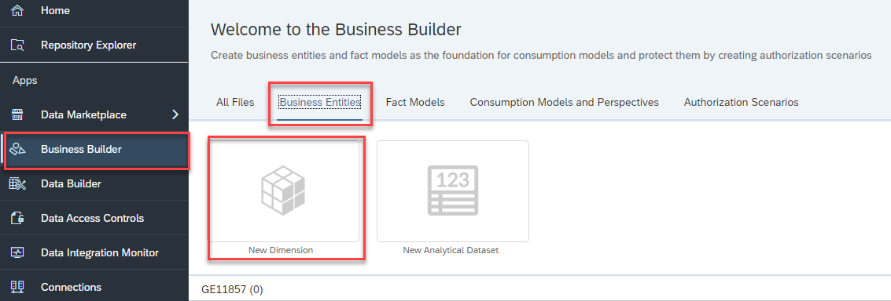
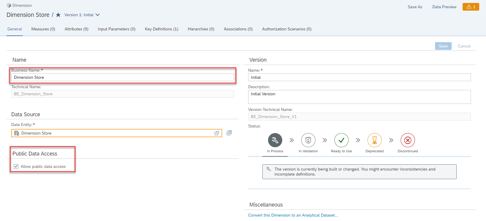
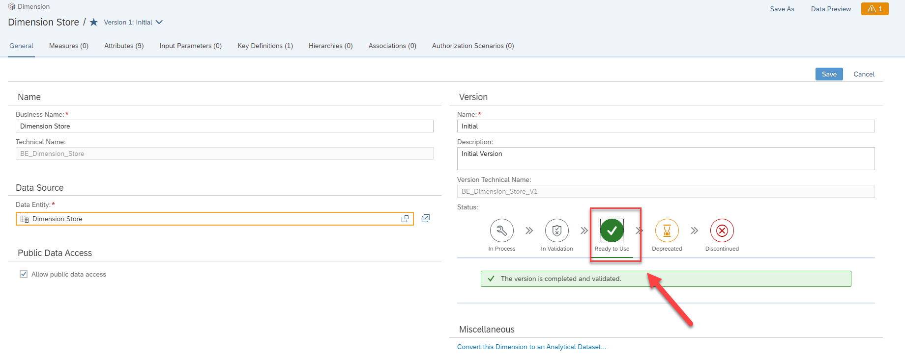

# Exercise 09 - Business Layer - Dimension 

> :memo: **Note:** This is a <strong>MANDATORY</strong>  Exercise

---

In this exercise, we will first setup the business entities and then create the consumption model, which
then will be used by SAP Analytics Cloud for our story.

1. Log On to your SAP Data Warehouse Cloud tenant.
2. Select the menu option Business Builder on the left-hand side.
3. In case you are being asked, select the Space you created previously.
4. Select the option Business Entities.
5. Select the option New Dimensions.
  

6. Select the entry for the Store dimension. Ensure to use the Dimension Store View and not the local table
Store.
7. Business Name and Technical Name will be suggested.
8. Click Create
  

9. You are then being asked, if you would like to leverage the existing Attributes and Key Definitions.
  

10. Ensure the option “Yes” is enabled.
11. Ensure the option Attributes is enabled.
12. Ensure the option Key Definitions is enabled.
13. Click Create.
  

14. Ensure the Business Name is set to Dimension Store.
15. Ensure the option Allow public data access is enabled.
 

16. Navigate to the tab Attributes.
17. You should see the following Attributes, which have been leveraged from our previous definition of the
dimension Store
  

18. Navigate to the tab Key Definitions.
19. You should see the Store ID being listed as Key Definition.
  

20. Navigate back to the tab General.
21. Set the Status to Ready to Use.
22. Click Save (top right).
  

---
> :memo: @Perla: we could use the repeat action we have used in the previous exercices also here, like with associations or fiule upload. ***What do you think?***
---

23. Select the menu option Business Builder on the left-hand side.
24. In case you are being asked, select the Space you created previously.
25. Select the option Business Entities.
26. Click New Dimension.
  

27. Select the entry Product.
28. For the Business Name enter Product.
29. For the Technical Name use the suggested name BE_Product.
30. Click Create.
  

31. You are then being asked, if you would like to leverage the existing Attributes and Key Definitions.
32. Ensure the option “Yes” is enabled.
33. Ensure the option Attributes is enabled.
34. Ensure the option Key Definitions is enabled.
35. Click Create.
  

36. Ensure the Business Name is set to Product.
37. Ensure the option Allow public data access is enabled.
  

38. Navigate to the tab Attributes.
39. You should see the following Attributes, which have been leveraged from our previous definition of the
dimension Store.
  

40. Navigate to the tab Key Definitions.
41. You should see the Product ID being listed as Key Definition.
  

42. Navigate back to the tab General.
43. Set the Status to Ready to Use
44. Click Save (top right).
  

45. Select the menu option Business Builder on the left-hand side.
46. In case you are being asked, select the Space you created previously.
47. Select the option Business Entities.
48. Click New Dimension.
  

49. Select the entry Sales Manager.
50. For the Business Name enter Sales Manager.
51. For the Technical Name use the suggested name BE_Sales_Manager.
52. Click Create.
  

53. You are then being asked, if you would like to leverage the existing Attributes and Key Definitions.
54. Ensure the option “Yes” is enabled.
55. Ensure the option Attributes is enabled.
56. Ensure the option Key Definitions is enabled.
57. Click Create.
  

58. Ensure the Business Name is set to Sales Manager.
59. Ensure the option Allow public data access is enabled.
60. Navigate to the tab Attributes.
61. You should see the above shown Attributes.
  

62. Navigate to the tab Key Definitions.
63. You should see the Sales Manager ID being listed as Key Definition.
 

64. Navigate back to the tab General.
65. Set the Status to Ready to Use.
66. Click Save (top right).
  

67. Select the menu option Business Builder on the left-hand side.
68. In case you are being asked, select the Space you created previously.
69. Select the option Business Entities.
70. Click New Dimension.
  

71. Select the entry Time Dimension - Day.
72. For the Business Name enter Time Dimension – Day (Business Layer).
73. For the Technical Name use the suggested name BE_SAP_TIME_VIEW_DIMENSION_DAY.
74. Click Create.
 

75. You are then being asked, if you would like to leverage the existing Attributes and Key Definitions.
76. Ensure the option “Yes” is enabled.
77. Ensure the option Attributes is enabled.
78. Ensure the option Key Definitions is enabled.
79. Click Create.
 

80. Ensure the Business Name is set to Time Dimension – Day (Business Layer).
81. Ensure the option Allow public data access is enabled.
 

82. Navigate to the tab Attributes.
83. You should see the above shown Attributes.
  

84. Navigate to the tab Key Definitions.
85. You should see the Date being listed as Key Definition.
 

86. Navigate back to the tab General.
87. Set the Status to Ready to Use.
88. Click Save
 

## Summary

You've now created reusable Business Builder Entities based on your data structures in the Data Builder.

Continue to - [Exercise 10: Business Layer – Analytical Dataset ](../ex10/README.md)
