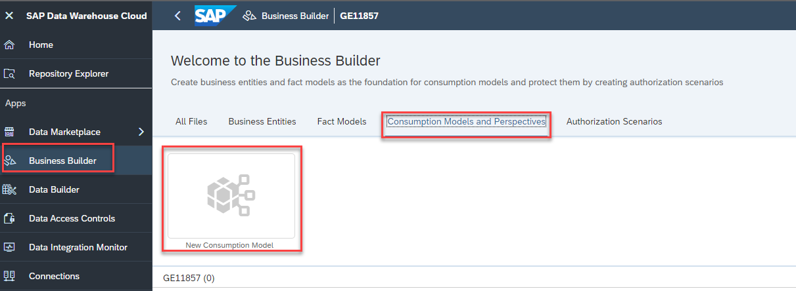
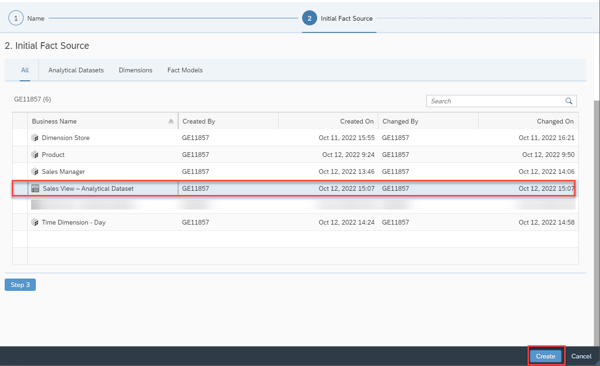
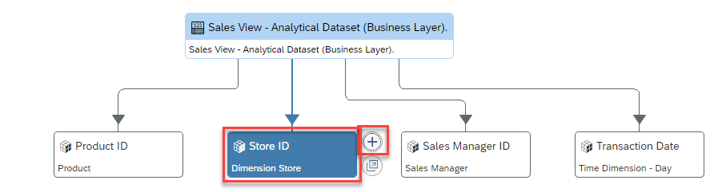
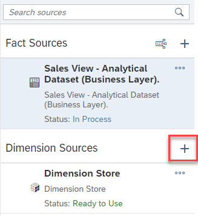
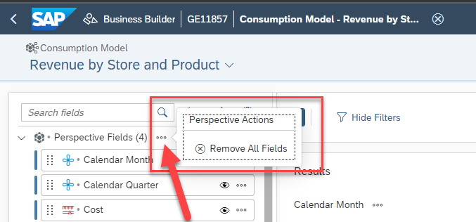
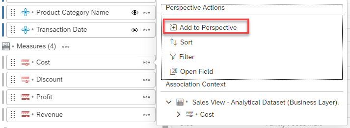

# Exercise 11 - Business Layer - Consumption Layer

> :memo: **Note:** This is a <strong>MANDATORY</strong>  Exercise

---

In this exercise, we will create the consumption layer for our analytical story.

1. Select the menu option Business Builder on the left-hand side.
2. In case you are being asked, select the Space you created previously.
3. Select the category Consumption Models and Perspectives.
4. Select the option New Consumption Model.
  

5. Enter ***Revenue by Store and Product*** as Name.
  

6. Click Step 2
  

7. Select the entry Sales View – Analytical Dataset (Business Layer).
8. Click Create.
  

9. Select the object for Dimension Store on the canvas.
  

10. Use the “+” icon for the option Add Source Context.
11. For the Source Alias option, enter Dimension Store.
12. Click Create.
  

13. On the right-hand side you should now see the dimension Store being listed under the category Dimension
Sources.
  

---
> :boom: ***Important*** :boom:   
> 14. You can now continue and repeat the steps 9-12 for the other associations: - Product - Sales Manager - Time Dimension – Day (Business Layer)  

---
  

15. Navigate to the tab General.
16. Enable the option Allow public data access.
17. Click Save (top right).
  

18. Navigate to the tab Measures.
19. Select the option Add Fact Source Measures.
  

20. Select all measures.
21. Click Apply.
  

22. Navigate to the tab Attributes.
23. Select the option Add Source Attributes.
  

24. Select the following 14 Attributes: <ul><li>Calendar Month</li><li>Calendar Quarter</li><li>Calendar Week</li><li>Country</li><li>Latitude</li><li>Longitude</li><li>Product Category Name</li><li>Product Name</li><li>Sales Manager Name</li><li>State Name</li><li>Store City</li><li>Store Location</li><li>Store Name</li><li>Transaction Date
 

25. Click Apply.
  

30. Navigate to the tab Perspectives.
31. Click on the Data Preview option (top right corner).
  

32. Open the context menu for the Perspective Fields header.
33. Select the option Remove All Fields.
  

34. Drag and Drop the following Dimensions to the list of Perspective Fields: <ul><li>Product Name</li><li>Calendar Quarter</li><li>Product Category Name</li><li>Store City</li><li>Country</li><li>Sales Manager Name</li><li>Store Name</li><li>State Name
  
   
     
35. Open the list of entries for Composite Attributes on the left hand side.
    
36. Drag and drop dimension Transaction Date to the Perspective Fields.
 
37. Navigate to the list of Measures on the left hand side.
 
38. Select measure Cost and open the More menu (…).
 
39. Select the option Add to Perspective.
   
  
  
40. Repeat the step for the measures Discount, Profit, and Revenue.
  
41. Click Save New (top right corner).
  
42. Enter ***Revenue by Store and Product (Perspective)*** as Business Name.
  
43. Enter ***Revenue_by_Store_and_Product_Perspective*** as Technical Name
  
44. Click Save.
   
  

  

We created the first perspective and just need to deploy the perspective now and can then leverage the
perspective in combination with SAP Analytics Cloud.
 45. Click on the name of the Consumption Model in the top.
 46. Click on Data Preview (top right) to close the Data Preview.
   
  
  

 47. Navigate to the tab Perspectives.
 48. Use the icon on the far right for to deploy the Perspective.
   
  
  
## Summary

You've now created our first consumption layer and perspective, which can now be used in SAP Analytics Cloud.

Continue to - [Exercise 12: Year over Year Comparison (requires Exercise 08 to be completed) ](../ex12/README.md)
