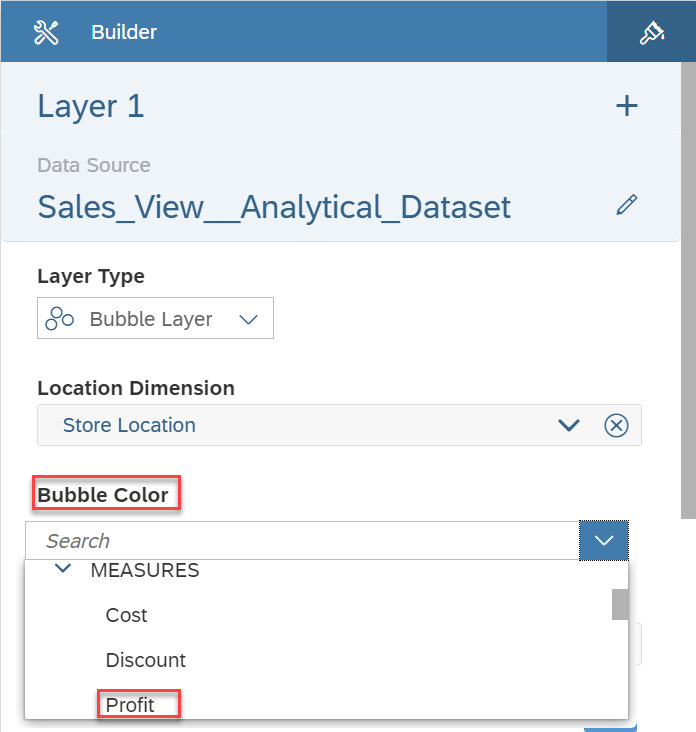

# Exercise 13 - Geographic Revenue Distribution

>:memo: **Note:** This is a <strong>MANDATORY</strong>  Exercise

---

In this exercise, we will we will setup a story in SAP Analytics Cloud, which allows us to view the measures along a
geographic map.

1. Log On to your SAP Analytics Cloud tenant.
  
 

---

:bulb: **Tip:** The system will ask you to resign in.

---

2. Select the menu Stories in the left-hand panel
3. Select the option Canvas to create a new Story.
  
4. Select "Classic Design Experience" when asked "What design mode would you like to use?"
  

5. In the toolbar click on “Data” (top left) to add data from SAP Data Warehouse Cloud to your Story.
6. Select the option Data From Data Source.
  

7. Open the list Connect to Live Data.
8. Select the entry SAP Data Warehouse Cloud.
  

9. You will be asked to select Connection to SAP Data Warehouse Cloud.
10. Please select "SAPDWC" as the connection 
 
 

11. When being asked to select your SPACE e.g. ***GE12345***.
12. Click OK.
15. Afterwards you will be asked to select the Analytical Data Set or the Perspective from your Space.
16. For our second example, we will use the Analytical Data Set – Sales View – Analytical Dataset.
17. Click OK.
    
  
18. Select the option to add a Geo Map.
  
  
19. Resize the map, so that it uses the complete screen.
20. In the panel on the right hand side, select the option “Add Layer” for the Content Layer option.
  

21. As we only have one dataset right now, the data set from SAP Data Warehouse Cloud will be assigned to
the new map layer.
22. Click on Add Location Dimension for the Location Dimension area
23. Select the option Store Location. This is the store location dimension we created previously based on the
longitude and latitude values for the store dimension.
  

24. Click on Add Measure for the Bubble Size.
25. Select measure Revenue.
  

26. Click Add Measure / Dimension for the Bubble Color
27. Select measure Profit.
  

28. Now open the details for the measure Profit as part of the Bubble Color
29. Open the list of Color Palette.
30. Select the second entry from the Diverging category going from Red to Green.
  

31. Now open the details for the Bubble Size definition.
32. Set the size to 35%.
  

33. Your map should look like this.
  

34. In the File menu select the option to save your story.
35. Select the User folder that matches your assigned user number.
36. Enter a Name and Description like ***Geographic Revenue Distribution***.
37. Click OK.

## Summary

You've now created your second story based on the live connection to your data models in SAP Data Warehouse Cloud. 

Continue to - [Best Salesperson (requires Exercise 11 to be completed) ](../ex14/README.md)
